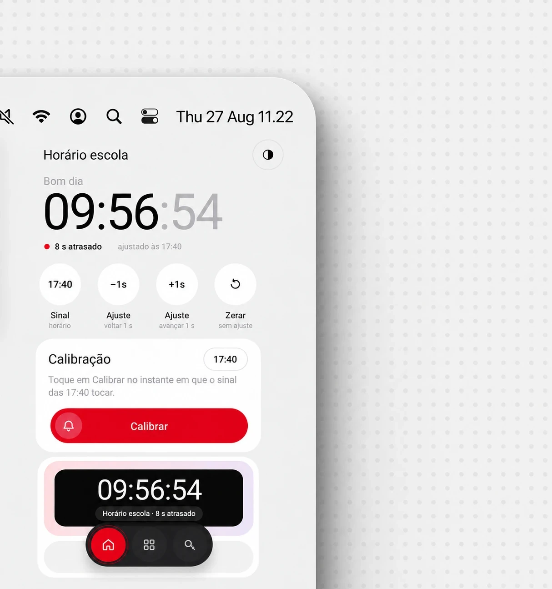

<div align="center">

<picture>
  <source media="(prefers-color-scheme: dark)" srcset="docs/logo-dark.png">
  
</picture>

<br>
<br>

[](https://github.com/crispinzz/time-calibrator/releases/latest)


**An Android app that calibrates your phone against an external clock (a school bell, an office time clock, a wall clock)<br>and shows that clock's time in real time, in the app and on your home screen.**

<br>



</div>

---

## The problem

Many clocks that run your day are not synchronized with real time:

- **School**: the bell rings 3 minutes before your phone says it should.
- **Work**: the time clock is 2 min 14 s behind.
- **Gym, bus, exams, shifts**: anywhere with an "official" clock that doesn't match yours.

Instead of subtracting minutes in your head every time, Time Calibrator measures the offset **once** and then shows that clock's time, to the second, in the app and in a home screen widget.

## How it works

1. Pick a reference time, for example **17:40**, when the bell rings.
2. The moment the external clock hits that time, tap **Calibrate**.
3. The app compares that instant with the phone's time and stores the difference:

```text
offset          = phone time at tap − reference time
calibrated time = now − offset
```

```text
Phone at tap       17:40:08
Bell rang at       17:40:00
────────────────────────────
Offset             8 s behind   → the app now shows the bell's time
```

Because the app stores an offset rather than a fixed time, it works for any reference (`07:00`, `12:00`, `18:30:15`) and for clocks that run **ahead or behind**. The offset is normalized to ±12 h, so calibrating at 00:00 while the phone reads 23:59:50 yields 10 s, not almost 24 h.

## Features

| | |
|---|---|
| **One-tap calibration** | Pick the bell time and tap *Calibrate* at the right moment. |
| **Fine tuning** | −1 s / +1 s buttons to correct without recalibrating, and *Reset* to go back to system time. |
| **Multiple clocks** | Each clock has its own name, calibration and look ("School", "Work", "Gym"...). |
| **Home screen widgets** | One widget per clock, ticking every second, with customizable background, text color, opacity and caption. |
| **Calibration codes** | Generates a short code (e.g. `59X-R8G`) you can send to a friend, who applies it and gets the same time without calibrating. Codes include a checksum, so a mistyped code is rejected instead of applying a wrong offset. |
| **Light, dark or automatic theme** | Widgets follow the app theme. |
| **Survives reboots** | Widgets reconfigure themselves after a reboot or a system time/time zone change. |

## Installation

### Option 1: APK (easiest)

1. Download `time-calibrator-v1.0.apk` from **[Releases](https://github.com/crispinzz/time-calibrator/releases/latest)**.
2. Open the file on your phone. If prompted, allow **"Install unknown apps"** for your browser or file manager.
3. To add the widget, long-press the home screen and go to **Widgets › Time Calibrator**, or use the *Apply widget* button inside the app.

> [!NOTE]
> The APK is signed with a debug key, so Play Protect may show an "unknown app" warning. Tap *Install anyway*.

> [!TIP]
> **MIUI / HyperOS (Xiaomi):** to keep the widget updating, enable *Autostart* and set *Battery saver* to **No restrictions** for the app.

### Option 2: ADB

With USB debugging enabled on the phone:

```bash
adb install time-calibrator-v1.0.apk
```

### Option 3: build from source

Requires **JDK 17** (the one bundled with Android Studio works) and **Android SDK 35**.

```bash
git clone https://github.com/crispinzz/time-calibrator.git
cd time-calibrator
./gradlew assembleDebug
```

The APK is written to `app/build/outputs/apk/debug/app-debug.apk`. You can also open the folder in Android Studio and hit Run.

## Requirements

| | |
|---|---|
| **Android** | 8.0 (Oreo, API 26) or newer |
| **Target SDK** | 35 (Android 15) |
| **Permissions** | `USE_EXACT_ALARM` / `SCHEDULE_EXACT_ALARM` so the widget handles day rollovers (midnight, 01:00 and 10:00) to the second, and `RECEIVE_BOOT_COMPLETED` to restore widgets after a reboot. **No internet access.** |
| **Dependencies** | `androidx.core` 1.13 · `androidx.appcompat` 1.7 · `material` 1.12 |

> The app UI is currently in Portuguese.

## Project structure

```text
app/src/main/java/br/com/timecalibrator/
├── MainActivity.kt          main screen, calibration and clock list
├── ClockOffset.kt           offset math and ±12 h normalization
├── CalibrationCode.kt       shareable code with checksum
├── ClockWidgetProvider.kt   home screen widget and day-rollover alarms
├── WidgetConfigActivity.kt  widget customization
├── Prefs.kt                 per-clock storage
└── ui/                      live clock, pickers, color picker and sheets
```

---

<div align="center">

Built by **[Gabriel Crispin](https://github.com/crispinzz)**.

</div>
